# DEMO1: Yellow light induced optogenetic denitrifier

## APP1: 2D-Visualization of gene panels (cluster)


```r
# setting parameters
rm(list=ls()) 
source('./scr/R/AppFunctions.R')

dataset = 'LY_9samples_metatranscriptomics'
group = 'Yellow_vs_Dark'
SubDataset <- 'YvsD_SubCell_dgi'

var_list <- basic_var(dataset, group, SubDataset)
```

```
## [1] "File ./data/LY_9samples_metatranscriptomics/inputdata/graphdata_Yellow_vs_Darklabeled.csv exists."
```

```r
p <- Clustering(dataset, group, SubDataset)
```

```
## [1] "File ./data/LY_9samples_metatranscriptomics/inputdata/graphdata_Yellow_vs_Darklabeled.csv exists."
```

```
## ── Attaching core tidyverse packages ──────────────────────── tidyverse 2.0.0 ──
## ✔ dplyr     1.1.2     ✔ readr     2.1.4
## ✔ forcats   1.0.0     ✔ stringr   1.5.0
## ✔ lubridate 1.9.2     ✔ tibble    3.2.1
## ✔ purrr     1.0.1     ✔ tidyr     1.3.0
## ── Conflicts ────────────────────────────────────────── tidyverse_conflicts() ──
## ✖ dplyr::filter() masks stats::filter()
## ✖ dplyr::lag()    masks stats::lag()
## ℹ Use the conflicted package (<http://conflicted.r-lib.org/>) to force all conflicts to become errors
## 
## Attaching package: 'cowplot'
## 
## 
## The following object is masked from 'package:lubridate':
## 
##     stamp
```

```
## Warning: The `size` argument of `element_line()` is deprecated as of ggplot2 3.4.0.
## ℹ Please use the `linewidth` argument instead.
## This warning is displayed once every 8 hours.
## Call `lifecycle::last_lifecycle_warnings()` to see where this warning was
## generated.
```

```r
p
```

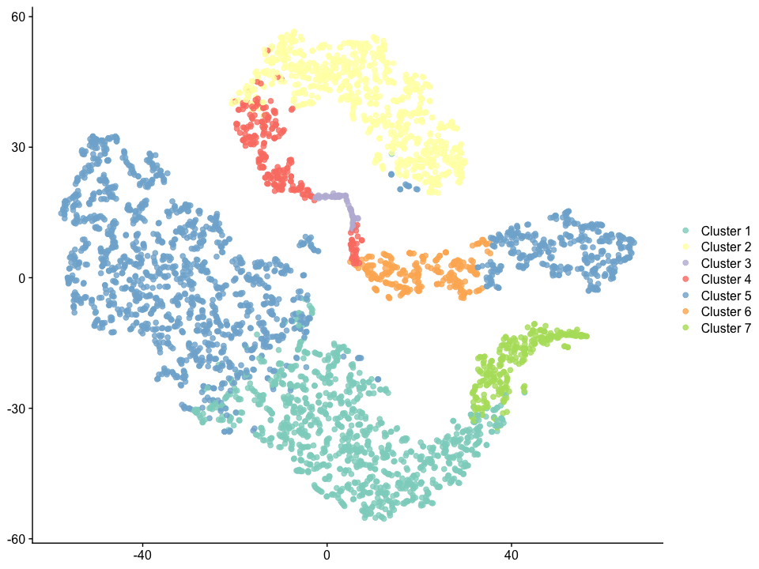<!-- -->


```r
# --- load functional genes ---
library(dplyr)

# setting parameters
dataset = 'LY_9samples_metatranscriptomics'
group = 'Yellow_vs_Dark'
SubDataset <- 'YvsD_SubCell_dgi'

var_list <- basic_var(dataset, group, SubDataset)
```

```
## [1] "File ./data/LY_9samples_metatranscriptomics/inputdata/graphdata_Yellow_vs_Darklabeled.csv exists."
```

```r
GeneSet_bycluster <- list('Cluster 1', 'Cluster 2','Cluster 3', 'Cluster 4', 'Cluster 5', 'Cluster 6', 'Cluster 7')
GeneSet_byswiss <- list(c('nitrate', 'nitrite'))
GeneSet_bykegg <- list(c('Phototransduction'))

# Annotation(dataset, group, SubDataset, GeneSet_bykegg,
#            GeneSet_byswiss=0, 
#            GeneSet_bycluster=0)
Annotation(dataset, group, SubDataset, GeneSet_bykegg=0,
           GeneSet_byswiss=0, 
           GeneSet_bycluster)
```

```
## [1] "File ./data/LY_9samples_metatranscriptomics/inputdata/graphdata_Yellow_vs_Darklabeled.csv exists."
## [1] "The total gene number of Cluster 1 is: 512"
## [1] "The total gene number of Cluster 2 is: 353"
## [1] "The total gene number of Cluster 3 is: 26"
## [1] "The total gene number of Cluster 4 is: 120"
## [1] "The total gene number of Cluster 5 is: 783"
## [1] "The total gene number of Cluster 6 is: 80"
## [1] "The total gene number of Cluster 7 is: 131"
```

## APP2: Panel enrichment analysis


```r
# rm(list=ls()) 
# --- setting parameters ---
# *dataset
dataset = 'LY_9samples_metatranscriptomics'
group = 'Yellow_vs_Dark'
SubDataset <- 'YvsD_SubCell_dgi'
Cluster = 'Cluster 3' 

# *set basic data for p-value and other statistic parameters calculations
ref_group <- 'Dark'
group_sample <- 'group_Yellow'
group_sample.path <- paste('./data/', dataset, '/inputdata/', group_sample, '.csv', sep = '')
group_sample.data <- read.csv(group_sample.path)
annotation.level <- 'level3_pathway_name'
# === pvalue and statistic analysis ===
rawdata <- obtain_pathdata(dataset, group, SubDataset, 
                            Cluster)
```

```
## [1] "The samples and groups are as follows:"
## [1] "Blue1.x" "Blue2.x" "Blue3.x" "Dark1"   "Dark2"   "Dark3"   "Yellow1"
## [8] "Yellow2" "Yellow3"
##   Samples  Group
## 1   Dark1   Dark
## 2   Dark2   Dark
## 3   Dark3   Dark
## 4   Blue1   Blue
## 5   Blue2   Blue
## 6   Blue3   Blue
## 7 Yellow1 Yellow
## 8 Yellow2 Yellow
## 9 Yellow3 Yellow
```

```r
# *setting for visualization app
fig.name <- paste(Cluster, ' of ', group_sample, sep = '')
  
# --- obtain expression level by pathway ---
library(dplyr)
pathway <- rawdata %>% 
  group_by(level3_pathway_name) %>%
  summarise(Dark1mean = mean(Dark1), 
            Dark2mean = mean(Dark2),
            Dark3mean = mean(Dark3),
            Yellow1mean = mean(Yellow1), 
            Yellow2mean = mean(Yellow2),
            Yellow3mean = mean(Yellow3)) 

# --- obtain p-value ---
df.pathlevel_p <- obtain_pvalue(dataset,ref_group, group_sample.data,  pathway, annotation.level)
```

```
## 
## Attaching package: 'ggpubr'
```

```
## The following object is masked from 'package:cowplot':
## 
##     get_legend
```

```r
# --- obtain other statistic parameters ---
df.pathlevel_p <- ObtainStatistic(pathway, df.pathlevel_p, group_sample.data)

# *set threshod for filtering
p_thre <- 0.2
FC_up <- 2
FC_down <- 0.5
Expre <- 10

# --- conduct enrichment analysis ---
fig <- enrich(df.pathlevel_p, SubDataset, dataset, Cluster,
                   p_thre, FC_up, FC_down, Expre,
                   group_sample.data)
```

```
## Warning: Using one column matrices in `filter()` was deprecated in dplyr 1.1.0.
## ℹ Please use one dimensional logical vectors instead.
## This warning is displayed once every 8 hours.
## Call `lifecycle::last_lifecycle_warnings()` to see where this warning was
## generated.
```

```
## [1] "File ./data/LY_9samples_metatranscriptomics/output_data/R/YvsD_SubCell_dgi_Cluster 3_Enrichment.csv Exist."
```

```
## Warning: ggrepel: 23 unlabeled data points (too many overlaps). Consider
## increasing max.overlaps
```

```r
fig
```

```
## Warning: ggrepel: 23 unlabeled data points (too many overlaps). Consider
## increasing max.overlaps
```

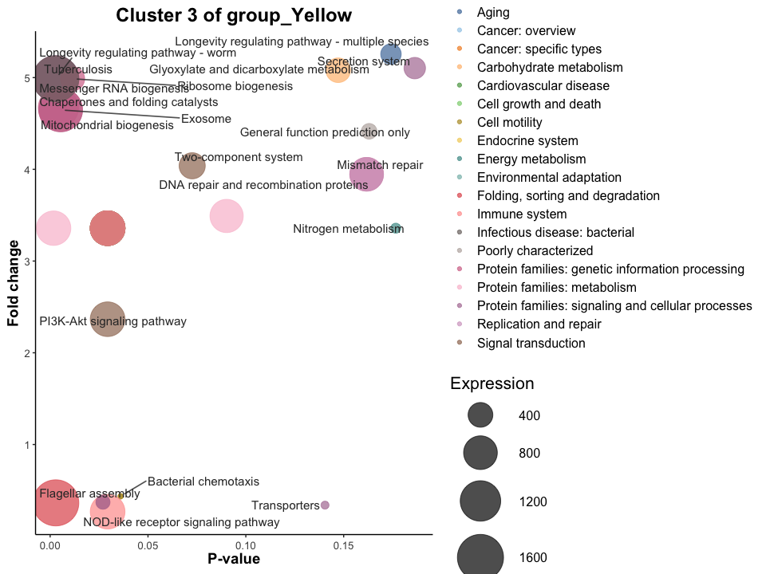<!-- -->

## APP3: Interested functions & genes analysis among gene panels

To conduct gene panels comparison, enrichment analysis of targeted panel
is a prerequisite. Please make sure to have used APP2 for enrichment
analysis with proper threshold.

-   In default, all the clusters are compared.

-   In this case, it can be observed clearly that cluster 3 is the hub
    gene panel with high expression level.


```r
# setting parameters
dataset = 'LY_9samples_metatranscriptomics'
group = 'Yellow_vs_Dark'
SubDataset <- 'YvsD_SubCell_dgi'

p <- GPsEnrichCompare(dataset, group, SubDataset, k=7) 
```

```
## Warning: ggrepel: 130 unlabeled data points (too many overlaps). Consider
## increasing max.overlaps
```

```r
p
```

```
## Warning: ggrepel: 130 unlabeled data points (too many overlaps). Consider
## increasing max.overlaps
```

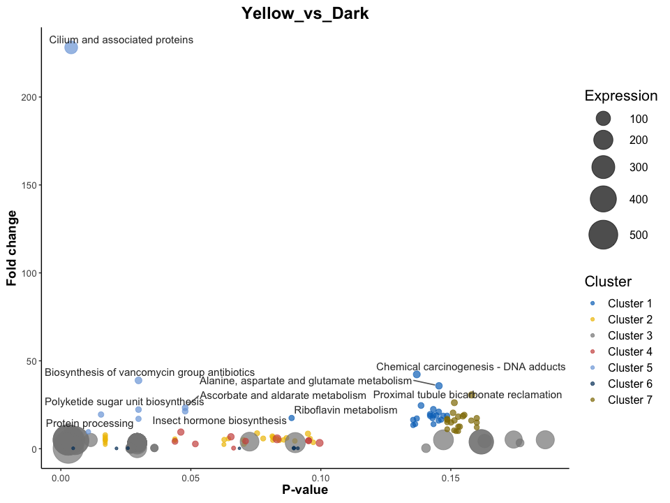<!-- -->

## APP4: Topology Network with landmark genes regulatory strategy

-   Obtain topological properties & landmark genes

From app3, we can identify the Hub Gene Panels (HGPs) and Signaling Gene
Panels (HGPs).

To better regulate the microbiome, we construct regulatory network, also
called interaction network, on the genes level based on microbial
genetic topology.

The occor.r and graph_list can also be utilized for visualization in
Gephi or R.


```r
# setting parameters
dataset <- 'LY_9samples_metatranscriptomics'
group <- 'Yellow_vs_Dark'
SubDataset <- 'YvsD_SubCell_dgi'
# *set basic data for statistic parameters calculations
ref_group <- 'Dark'
group_sample <- 'group_Yellow'
group_sample.path <- paste('./data/', dataset, '/inputdata/', group_sample, '.csv', sep = '')
group_sample.data <- read.csv(group_sample.path)

# --- gene panel setting ---
# *setting for gene searching: Obtain the targeted genes and corresponding gene panel
# method 1: manually set interested gene panel (cluster)
Cluster <- 'Cluster 3' # HGP
# method 2: search the gene panel that interested gene or pathway assigned to 
interested.gene <- 'nitrite'
interested.pathway <- 'Phototransduction'
SearchGene <- TRUE
SearchPathway <- FALSE
'
option: level3_pathway_name, ko_des, SwissProt_Description
'
```

```
## [1] "\noption: level3_pathway_name, ko_des, SwissProt_Description\n"
```

```r
Cluster <- Search_GePa(var_list, SearchGene=TRUE, SearchPathway=FALSE)
```

```
## [1] "Most of nitrite related gene belong to:"
## Cluster 4 
##         5 
## [1] "The cluster distribution of nitrite is:"
## 
## Cluster 2 Cluster 3 Cluster 4 Cluster 5 Cluster 6 
##         3         2         5         1         1
```

```r
# === obtain correlation matrix: occor.r ===
occor.r <- ObtainCorNet(dataset, SubDataset, Cluster, group, group_sample.data, gene_name=TRUE, thre.p = 0.05, thre.r = 0.8)
```

```
## [1] "The samples and groups are as follows:"
## [1] "Blue1.x" "Blue2.x" "Blue3.x" "Dark1"   "Dark2"   "Dark3"   "Yellow1"
## [8] "Yellow2" "Yellow3"
##   Samples  Group
## 1   Dark1   Dark
## 2   Dark2   Dark
## 3   Dark3   Dark
## 4   Blue1   Blue
## 5   Blue2   Blue
## 6   Blue3   Blue
## 7 Yellow1 Yellow
## 8 Yellow2 Yellow
## 9 Yellow3 Yellow
```

```
## 
## Attaching package: 'psych'
```

```
## The following objects are masked from 'package:ggplot2':
## 
##     %+%, alpha
```

```
## [1] "File ./data/LY_9samples_metatranscriptomics/output_data/R/YvsD_SubCell_dgi_Cluster 4_p0.05_r0.8_CorNet.csv exists."
```

```r
library(igraph)
```

```
## 
## Attaching package: 'igraph'
```

```
## The following objects are masked from 'package:lubridate':
## 
##     %--%, union
```

```
## The following objects are masked from 'package:dplyr':
## 
##     as_data_frame, groups, union
```

```
## The following objects are masked from 'package:purrr':
## 
##     compose, simplify
```

```
## The following object is masked from 'package:tidyr':
## 
##     crossing
```

```
## The following object is masked from 'package:tibble':
## 
##     as_data_frame
```

```
## The following objects are masked from 'package:stats':
## 
##     decompose, spectrum
```

```
## The following object is masked from 'package:base':
## 
##     union
```

```r
# parameter setting*
ExploreDegree = FALSE
ExploreNeibor = FALSE
adjacency_weight <- occor.r
igraph <- graph_from_adjacency_matrix(as.matrix(adjacency_weight), mode = 'undirected', weighted = TRUE, diag = FALSE)

# === obtain graph: graph_list ===
graph_list <- ObtainGraph(dataset, SubDataset, Cluster, group, group_sample.data, igraph, gene_name=TRUE, thre.p = 0.05, thre.r = 0.8)
```

```
## [1] "The total nodes number is: 22"
```

```r
# --- obtain landmark genes ----
landmark.ordered <- obtain_landmark(graph_list, dataset, group, SubDataset, 
                            Cluster, group_sample.data)
```

```
## [1] "The samples and groups are as follows:"
## [1] "Blue1.x" "Blue2.x" "Blue3.x" "Dark1"   "Dark2"   "Dark3"   "Yellow1"
## [8] "Yellow2" "Yellow3"
##   Samples  Group
## 1   Dark1   Dark
## 2   Dark2   Dark
## 3   Dark3   Dark
## 4   Blue1   Blue
## 5   Blue2   Blue
## 6   Blue3   Blue
## 7 Yellow1 Yellow
## 8 Yellow2 Yellow
## 9 Yellow3 Yellow
```

```r
landmark.top5 <- landmark.ordered$ko_name[1:5]

print(paste('The top 5 landmark genes of', Cluster, 'is:'))
```

```
## [1] "The top 5 landmark genes of Cluster 4 is:"
```

```r
print(landmark.top5)
```

```
## [1] NA NA NA NA NA
```

-   Visualization


```r
# 设置不同type的边颜色不同 
pale8 <- c("#8DD3C7FF","#FFFFB3FF","#BEBADAFF","#FB8072FF","#80B1D3FF","#FDB462FF","#B3DE69FF","#FCCDE5FF")
E(igraph)$color <- "#FB8072FF" 
index <- E(igraph)$type == "mention"
E(igraph)$color <- '#8DD3C7FF'

plot(igraph, 
     vertex.color = '#BEBADAFF', edge.color = E(igraph)$color,
     layout = layout_in_circle)
```

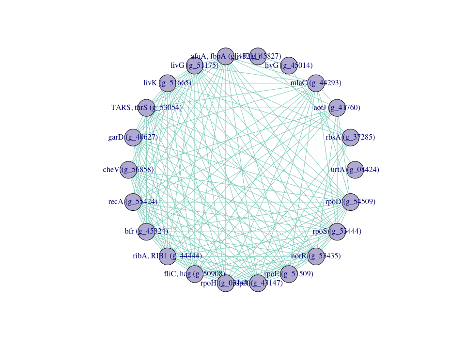<!-- -->

```r
# cfg <- cluster_fast_greedy(igraph)
# plot(cfg, igraph)
```

# DEMO2: Blue light induced optogenetic denitrifier

## APP1: 2D-Visualization of gene panels (cluster)


```r
# setting parameters
dataset = 'LY_9samples_metatranscriptomics'
group = 'Blue_vs_Dark'
SubDataset <- 'BvsD_SubCell_dgi'

var_list <- basic_var(dataset, group, SubDataset)
```

```
## [1] "File ./data/LY_9samples_metatranscriptomics/inputdata/graphdata_Blue_vs_Darklabeled.csv exists."
```

```r
p <- Clustering(dataset, group, SubDataset)
```

```
## [1] "File ./data/LY_9samples_metatranscriptomics/inputdata/graphdata_Blue_vs_Darklabeled.csv exists."
```

```r
p
```

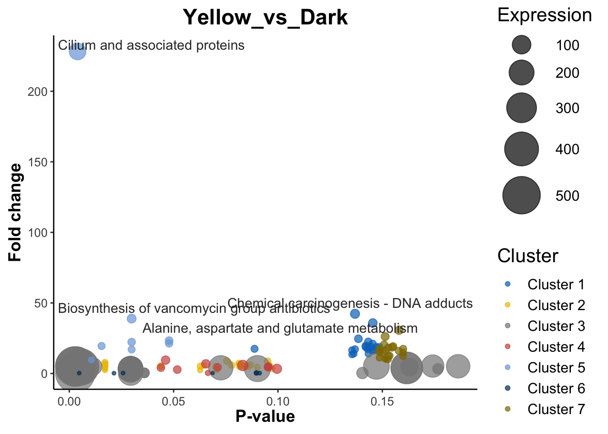<!-- -->


```r
# --- load functional genes ---
library(dplyr)

# setting parameters
dataset = 'LY_9samples_metatranscriptomics'
group = 'Blue_vs_Dark'
SubDataset <- 'BvsD_SubCell_dgi'

var_list <- basic_var(dataset, group, SubDataset)
```

```
## [1] "File ./data/LY_9samples_metatranscriptomics/inputdata/graphdata_Blue_vs_Darklabeled.csv exists."
```

```r
GeneSet_bycluster <- list('Cluster 1', 'Cluster 2','Cluster 3', 'Cluster 4', 'Cluster 5', 'Cluster 6', 'Cluster 7')
GeneSet_byswiss <- list(c('nitrate', 'nitrite'))
GeneSet_bykegg <- list(c('Phototransduction'))

# Annotation(dataset, group, SubDataset, GeneSet_bykegg,
#            GeneSet_byswiss=0, 
#            GeneSet_bycluster=0)
Annotation(dataset, group, SubDataset, GeneSet_bykegg=0,
           GeneSet_byswiss=0, 
           GeneSet_bycluster) 
```

```
## [1] "File ./data/LY_9samples_metatranscriptomics/inputdata/graphdata_Blue_vs_Darklabeled.csv exists."
## [1] "The total gene number of Cluster 1 is: 1838"
## [1] "The total gene number of Cluster 2 is: 767"
## [1] "The total gene number of Cluster 3 is: 4180"
## [1] "The total gene number of Cluster 4 is: 394"
## [1] "The total gene number of Cluster 5 is: 2105"
## [1] "The total gene number of Cluster 6 is: 899"
## [1] "The total gene number of Cluster 7 is: 744"
```

```r
# The output are all unique genes
```

Cluster 1 Cluster 2 Cluster 3 Cluster 4 Cluster 5 Cluster 6 Cluster 7
4828 1795 9533 1273 4198 2061 1589

## APP2: Panel enrichment analysis


```r
# rm(list=ls()) 
# --- setting parameters ---
# *dataset
dataset = 'LY_9samples_metatranscriptomics'
group = 'Blue_vs_Dark'
SubDataset <- 'BvsD_SubCell_dgi'
Cluster = 'Cluster 7' 

# *set basic data for p-value and other statistic parameters calculations
ref_group <- 'Dark'
group_sample <- 'group_Blue'
group_sample.path <- paste('./data/', dataset, '/inputdata/', group_sample, '.csv', sep = '')
group_sample.data <- read.csv(group_sample.path)
annotation.level <- 'level3_pathway_name'
# === pvalue and statistic analysis ===
rawdata <- obtain_pathdata(dataset, group, SubDataset, 
                            Cluster)
```

```
## [1] "The samples and groups are as follows:"
## [1] "Blue1"     "Blue2"     "Blue3"     "Dark1"     "Dark2"     "Dark3"    
## [7] "Yellow1.x" "Yellow2.x" "Yellow3.x"
##   Samples  Group
## 1   Dark1   Dark
## 2   Dark2   Dark
## 3   Dark3   Dark
## 4   Blue1   Blue
## 5   Blue2   Blue
## 6   Blue3   Blue
## 7 Yellow1 Yellow
## 8 Yellow2 Yellow
## 9 Yellow3 Yellow
```

```r
# *setting for visualization app
fig.name <- paste(Cluster, ' of ', group_sample, sep = '')
  
# --- obtain expression level by pathway ---
library(dplyr)
pathway <- rawdata %>% 
  group_by(level3_pathway_name) %>%
  summarise(Dark1mean = mean(Dark1), 
            Dark2mean = mean(Dark2),
            Dark3mean = mean(Dark3),
            Blue1mean = mean(Blue1), 
            Blue2mean = mean(Blue2),
            Blue3mean = mean(Blue3)) 

# --- obtain p-value ---
df.pathlevel_p <- obtain_pvalue(dataset,ref_group, group_sample.data,  pathway, annotation.level)

# --- obtain other statistic parameters ---
df.pathlevel_p <- ObtainStatistic(pathway, df.pathlevel_p, group_sample.data)

# *set threshod for filtering
if (Cluster == 'Cluster 4'){
  p_thre <- 0.05
  FC_up <- 2
  FC_down <- 0.2
  Expre <- 20
} else if (Cluster == 'Cluster 5'){
  p_thre <- 0.001 
  FC_up <- 10
  FC_down <- 0.5
  Expre <- 10
} else if (Cluster == 'Cluster 7'){
  p_thre <- 0.01
  FC_up <- 2
  FC_down <- 0.5
  Expre <- 10
} else if (Cluster == 'Cluster 2'){
  p_thre <- 0.001
  FC_up <- 2
  FC_down <- 0.5
  Expre <- 10
} else if (Cluster == 'Cluster 3'){
  p_thre <- 0.01
  FC_up <- 2
  FC_down <- 0.5
  Expre <- 5.5
} else if (Cluster == 'Cluster 1'){
  p_thre <- 0.01
  FC_up <- 2
  FC_down <- 0.5
  Expre <- 1.5
} else if (Cluster == 'Cluster 6'){
  p_thre <- 0.01
  FC_up <- 2
  FC_down <- 0.5
  Expre <- 10
}


# --- conduct enrichment analysis ---
fig <- enrich(df.pathlevel_p, SubDataset, dataset, Cluster,
                   p_thre, FC_up, FC_down, Expre,
                   group_sample.data)
```

```
## [1] "File ./data/LY_9samples_metatranscriptomics/output_data/R/BvsD_SubCell_dgi_Cluster 7_Enrichment.csv Exist."
```

```r
fig
```

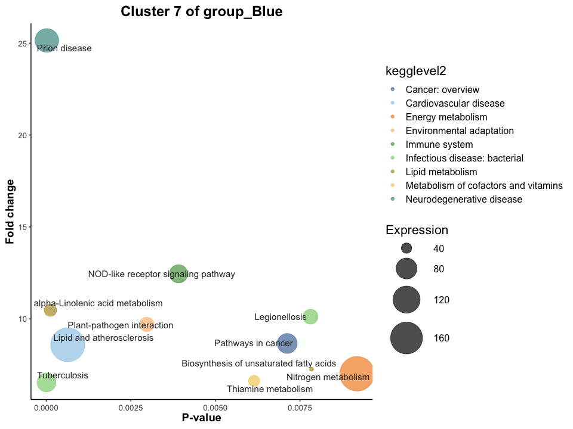<!-- -->

## APP3: Interested functions & genes analysis among gene panels

To conduct gene panels comparison, enrichment analysis of targeted panel
is a prerequisite. Please make sure to have used APP2 for enrichment
analysis with proper threshold.

-   In default, all the clusters are compared.

-   In this case, it can be observed clearly that cluster 3 is the hub
    gene panel with high expression level.


```r
# setting parameters
dataset = 'LY_9samples_metatranscriptomics'
group = 'Blue_vs_Dark'
SubDataset <- 'BvsD_SubCell_dgi'

p <- GPsEnrichCompare(dataset, group, SubDataset, k=7) 
```

```
## Warning: ggrepel: 100 unlabeled data points (too many overlaps). Consider
## increasing max.overlaps
```

```r
p
```

```
## Warning: ggrepel: 101 unlabeled data points (too many overlaps). Consider
## increasing max.overlaps
```

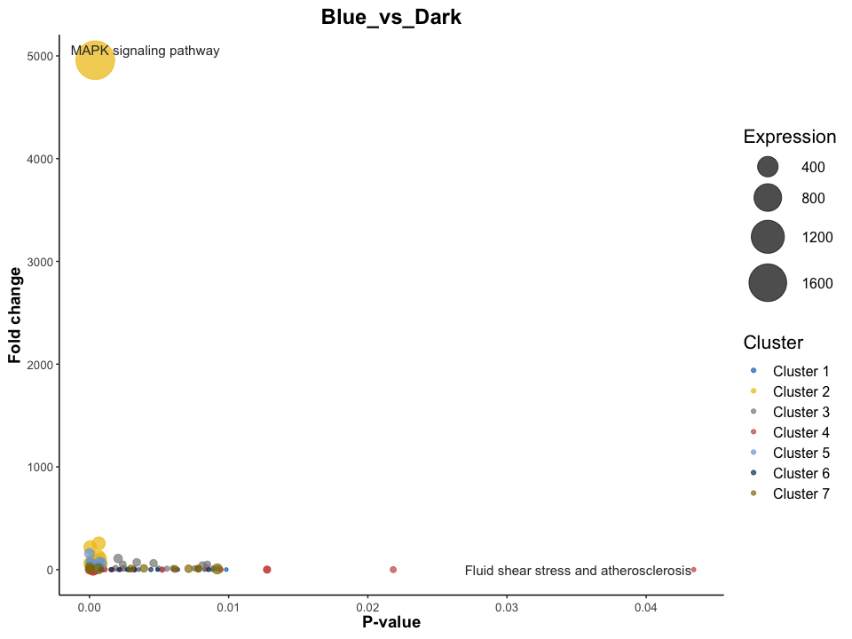<!-- -->

## APP4: Topology Network with landmark genes regulatory strategy


```r
# setting parameters
dataset = 'LY_9samples_metatranscriptomics'
group = 'Blue_vs_Dark'
SubDataset <- 'BvsD_SubCell_dgi'
# *set basic data for statistic parameters calculations
ref_group <- 'Dark'
group_sample <- 'group_Blue'
group_sample.path <- paste('./data/', dataset, '/inputdata/', group_sample, '.csv', sep = '')
group_sample.data <- read.csv(group_sample.path)

# --- gene panel setting ---
# *setting for gene searching: Obtain the targeted genes and corresponding gene panel
# method 1: manually set interested gene panel (cluster)
Cluster <- 'Cluster 3' # HGP
# method 2: search the gene panel that interested gene or pathway assigned to 
interested.gene <- 'nitrite'
interested.pathway <- 'Phototransduction'
SearchGene <- TRUE
SearchPathway <- FALSE
'
option: level3_pathway_name, ko_des, SwissProt_Description
'
```

```
## [1] "\noption: level3_pathway_name, ko_des, SwissProt_Description\n"
```

```r
Cluster <- Search_GePa(var_list, SearchGene=TRUE, SearchPathway=FALSE)
```

```
## [1] "Most of nitrite related gene belong to:"
## Cluster 3 
##        31 
## [1] "The cluster distribution of nitrite is:"
## 
## Cluster 1 Cluster 2 Cluster 3 Cluster 4 Cluster 5 Cluster 6 Cluster 7 
##        16        12        31         9         6         5         9
```

```r
# === obtain correlation matrix: occor.r ===
occor.r <- ObtainCorNet(dataset, SubDataset, Cluster, group, group_sample.data, gene_name=FALSE, thre.p = 0.05, thre.r = 0.8)
```

```
## [1] "The samples and groups are as follows:"
## [1] "Blue1"     "Blue2"     "Blue3"     "Dark1"     "Dark2"     "Dark3"    
## [7] "Yellow1.x" "Yellow2.x" "Yellow3.x"
##   Samples  Group
## 1   Dark1   Dark
## 2   Dark2   Dark
## 3   Dark3   Dark
## 4   Blue1   Blue
## 5   Blue2   Blue
## 6   Blue3   Blue
## 7 Yellow1 Yellow
## 8 Yellow2 Yellow
## 9 Yellow3 Yellow
## [1] "File ./data/LY_9samples_metatranscriptomics/output_data/R/BvsD_SubCell_dgi_Cluster 3_p0.05_r0.8_CorNet.csv exists."
```

```r
library(igraph)
# parameter setting*
ExploreDegree = FALSE
ExploreNeibor = FALSE
adjacency_weight <- occor.r
igraph <- graph_from_adjacency_matrix(as.matrix(adjacency_weight), mode = 'undirected', weighted = TRUE, diag = FALSE)

# === obtain graph: graph_list ===
graph_list <- ObtainGraph(dataset, SubDataset, Cluster, group, group_sample.data, igraph, gene_name=FALSE, thre.p = 0.05, thre.r = 0.8) 
```

```
## [1] "The total nodes number is: 470"
```

```r
# --- obtain landmark genes ----
landmark.ordered <- obtain_landmark(graph_list, dataset, group, SubDataset, 
                            Cluster, group_sample.data)
```

```
## [1] "The samples and groups are as follows:"
## [1] "Blue1"     "Blue2"     "Blue3"     "Dark1"     "Dark2"     "Dark3"    
## [7] "Yellow1.x" "Yellow2.x" "Yellow3.x"
##   Samples  Group
## 1   Dark1   Dark
## 2   Dark2   Dark
## 3   Dark3   Dark
## 4   Blue1   Blue
## 5   Blue2   Blue
## 6   Blue3   Blue
## 7 Yellow1 Yellow
## 8 Yellow2 Yellow
## 9 Yellow3 Yellow
```

```r
landmark.top5 <- landmark.ordered$ko_name[1:5]

print(paste('The top 5 landmark genes of', Cluster, 'is:'))
```

```
## [1] "The top 5 landmark genes of Cluster 3 is:"
```

```r
print(landmark.top5)
```

```
## [1] "fusA, GFM, EFG"  "folD"            "E3.1.11.2, xthA" "fusA, GFM, EFG" 
## [5] "trpB"
```

-   Visualization: network


```r
# 设置不同type的边颜色不同 
pale8 <- c("#8DD3C7FF","#FFFFB3FF","#BEBADAFF","#FB8072FF","#80B1D3FF","#FDB462FF","#B3DE69FF","#FCCDE5FF")
E(igraph)$color <- "#FB8072FF" 
index <- E(igraph)$type == "mention"
E(igraph)$color <- '#8DD3C7FF'

plot(igraph, 
     vertex.color = '#BEBADAFF', edge.color = E(igraph)$color,
     layout = layout_in_circle)
```

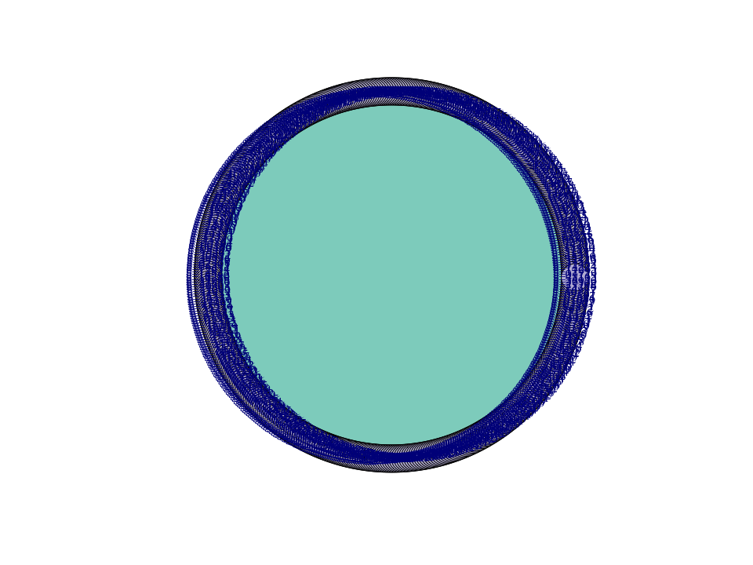<!-- -->

```r
cfg <- cluster_fast_greedy(igraph)
plot(cfg, igraph)
```

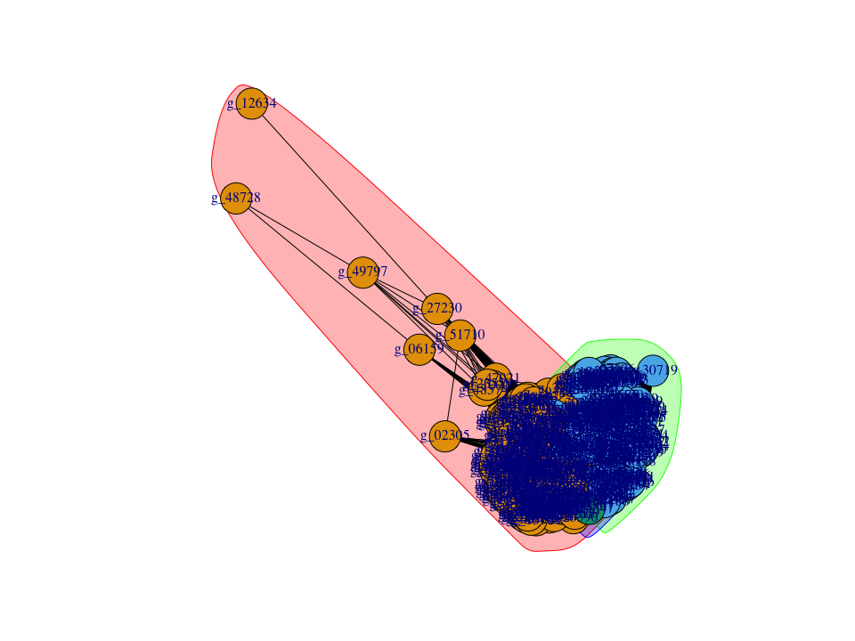<!-- -->

# DEMO3: Yellow light induced denitrifier based on metagenomics

### Graph Learning Results

-   The gene panels are obtained after 20000 epochs

    feature shape: (5, 57)

    cuda is not available

    Threshold: 4

    Links number: 541

    Average Links: 9.491228070175438

    Adj: (57, 57) Edges: 541

    X: (57, 5)

-   Result; SCI score (Clustering quality) is: 0.59939337

-   Tips: increase threshold will bring about more edges, that more
    information can be passed to the neighboring nodes, while the
    calculation time will also be longer and probably lead to
    over-fitting.

### APP1: 2D-Visualization of gene panels (cluster)


```r
# rm(list=ls()) 
# --- load functional genes ---
library(dplyr)

# setting parameters
dataset = 'LY_15samples_metagenomics'
group = 'Yellow_vs_Dark'
SubDataset <- 'Yellow_vs_Dark'

var_list <- basic_var(dataset, group, SubDataset)
```

```
## [1] "File ./data/LY_15samples_metagenomics/inputdata/graphdata_Yellow_vs_Darklabeled.csv exists."
```

```r
p <- Clustering(dataset, group, SubDataset)
```

```
## [1] "File ./data/LY_15samples_metagenomics/inputdata/graphdata_Yellow_vs_Darklabeled.csv exists."
```

```r
p
```

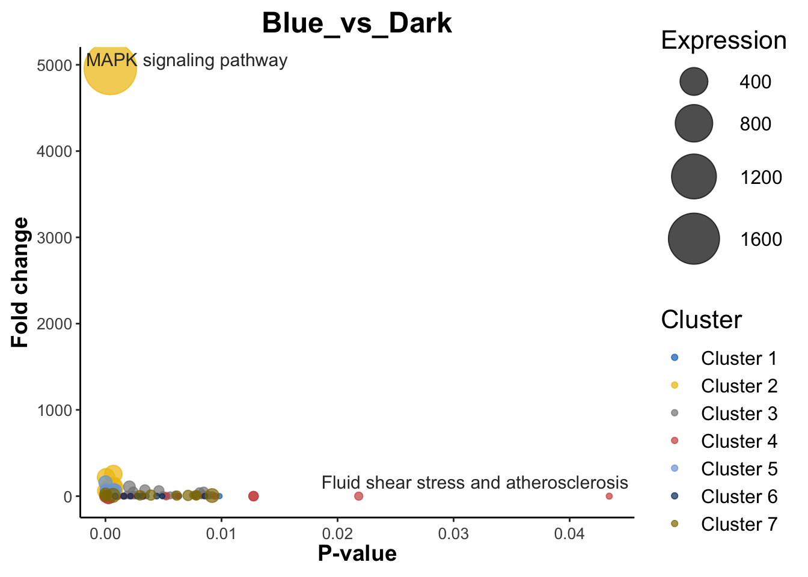<!-- -->

### APP2

-   output:

```         
[1] "The total gene number of Cluster 1 is: 7"
[1] "The total gene number of Cluster 2 is: 9"
[1] "The total gene number of Cluster 3 is: 3"
[1] "The total gene number of Cluster 4 is: 7"
[1] "The total gene number of Cluster 5 is: 15"
[1] "The total gene number of Cluster 6 is: 8"
[1] "The total gene number of Cluster 7 is: 8"
```


```r
# rm(list=ls()) 
dataset = 'LY_15samples_metagenomics'
group = 'Yellow_vs_Dark'
SubDataset <- 'Yellow_vs_Dark'

var_list <- basic_var(dataset, group, SubDataset)
```

```
## [1] "File ./data/LY_15samples_metagenomics/inputdata/graphdata_Yellow_vs_Darklabeled.csv exists."
```

```r
GeneSet_bycluster <- list('Cluster 1', 'Cluster 2', 'Cluster 3', 'Cluster 4', 'Cluster 5', 'Cluster 6', 'Cluster 7')
# GeneSet_byswiss <- list(c('nitrate', 'nitrite'))
# GeneSet_bykegg <- list(c('Phototransduction'))

# Annotation(dataset, group, SubDataset, GeneSet_bykegg,
#            GeneSet_byswiss=0, 
#            GeneSet_bycluster=0)
Annotation(dataset, group, SubDataset, GeneSet_bykegg=0,
           GeneSet_byswiss=0, 
           GeneSet_bycluster)
```

```
## [1] "File ./data/LY_15samples_metagenomics/inputdata/graphdata_Yellow_vs_Darklabeled.csv exists."
## [1] "The total gene number of Cluster 1 is: 7"
## [1] "The total gene number of Cluster 2 is: 9"
## [1] "The total gene number of Cluster 3 is: 3"
## [1] "The total gene number of Cluster 4 is: 7"
## [1] "The total gene number of Cluster 5 is: 15"
## [1] "The total gene number of Cluster 6 is: 8"
## [1] "The total gene number of Cluster 7 is: 8"
```


```r
# rm(list=ls()) 
# --- setting parameters ---
# *dataset
dataset = 'LY_15samples_metagenomics'
group = 'Yellow_vs_Dark'
SubDataset <- 'Yellow_vs_Dark'
Cluster = 'Cluster 5' 

# *set basic data for p-value and other statistic parameters calculations
ref_group <- 'Dark'
group_sample <- 'group_Yellow'
group_sample.path <- paste('./data/', dataset, '/inputdata/', group_sample, '.csv', sep = '')
group_sample.data <- read.csv(group_sample.path)
annotation.level <- 'level3_pathway_name'
# === pvalue and statistic analysis ===
rawdata <- obtain_pathdata(dataset, group, SubDataset, 
                            Cluster)
```

```
## [1] "The samples and groups are as follows:"
##  [1] "G3A" "G2A" "R3A" "D2A" "Y1A" "Y2A" "B2A" "R1A" "D3A" "B1A" "Y3A" "B3A"
## [13] "D1A" "G1A" "R2A"
##    Samples  Group
## 1      D2A   Dark
## 2      D3A   Dark
## 3      D1A   Dark
## 4      B2A   Blue
## 5      B1A   Blue
## 6      B3A   Blue
## 7      G3A  Green
## 8      G2A  Green
## 9      G1A  Green
## 10     R3A    Red
## 11     R1A    Red
## 12     R2A    Red
## 13     Y1A Yellow
## 14     Y2A Yellow
## 15     Y3A Yellow
```

```r
# *setting for visualization app
fig.name <- paste('HGP of ', group_sample, sep = '')
  
# --- obtain expression level by pathway ---
library(dplyr)
pathway <- rawdata %>% 
  group_by(level3_pathway_name) %>%
  summarise(Dark1mean = mean(D1A), 
            Dark2mean = mean(D2A),
            Dark3mean = mean(D3A),
            Yellow1mean = mean(Y1A), 
            Yellow2mean = mean(Y2A),
            Yellow3mean = mean(Y3A)) 

# --- obtain p-value ---
df.pathlevel_p <- obtain_pvalue(dataset,ref_group, group_sample.data,  pathway, annotation.level)

# --- obtain other statistic parameters ---
df.pathlevel_p <- ObtainStatistic(pathway, df.pathlevel_p, group_sample.data)

# *set threshod for filtering
p_thre <- 0.275
FC_up <- 1
FC_down <- 1
Expre <- 0

# --- conduct enrichment analysis ---
fig <- enrich(df.pathlevel_p, SubDataset, dataset, Cluster,
                   p_thre, FC_up, FC_down, Expre,
                   group_sample.data)
```

```
## [1] "File ./data/LY_15samples_metagenomics/output_data/R/Yellow_vs_Dark_Cluster 5_Enrichment.csv Exist."
```

```r
fig
```

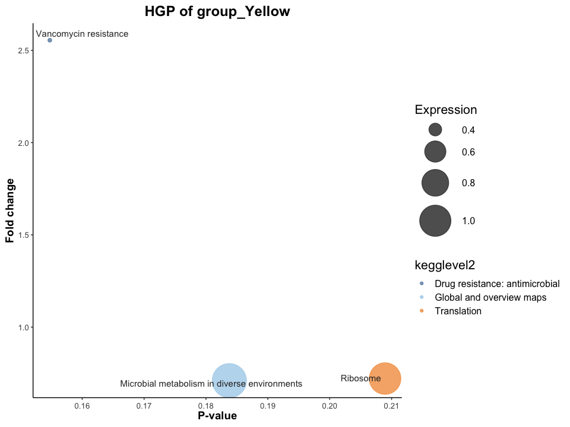<!-- -->

# DEMO3: Blue light induced metagenomics

### Graph learning

feature shape: (5, 88)

cuda is not available

Threshold: 2

Links number: 1040

Average Links: 11.818181818181818

Adj: (88, 88) Edges: 1040

X: (88, 5)

-   SCI score (Clustering quality) is: 0.60509825

### APP1: 2D-Visualization of gene panels (cluster)


```r
# --- load functional genes ---
library(dplyr)

# setting parameters
dataset = 'LY_15samples_metagenomics'
group = 'Blue_vs_Dark'
SubDataset <- 'Blue_vs_Dark'

var_list <- basic_var(dataset, group, SubDataset)
```

```
## [1] "File ./data/LY_15samples_metagenomics/inputdata/graphdata_Blue_vs_Darklabeled.csv exists."
```

```r
p <- Clustering(dataset, group, SubDataset)
```

```
## [1] "File ./data/LY_15samples_metagenomics/inputdata/graphdata_Blue_vs_Darklabeled.csv exists."
```

```r
p
```

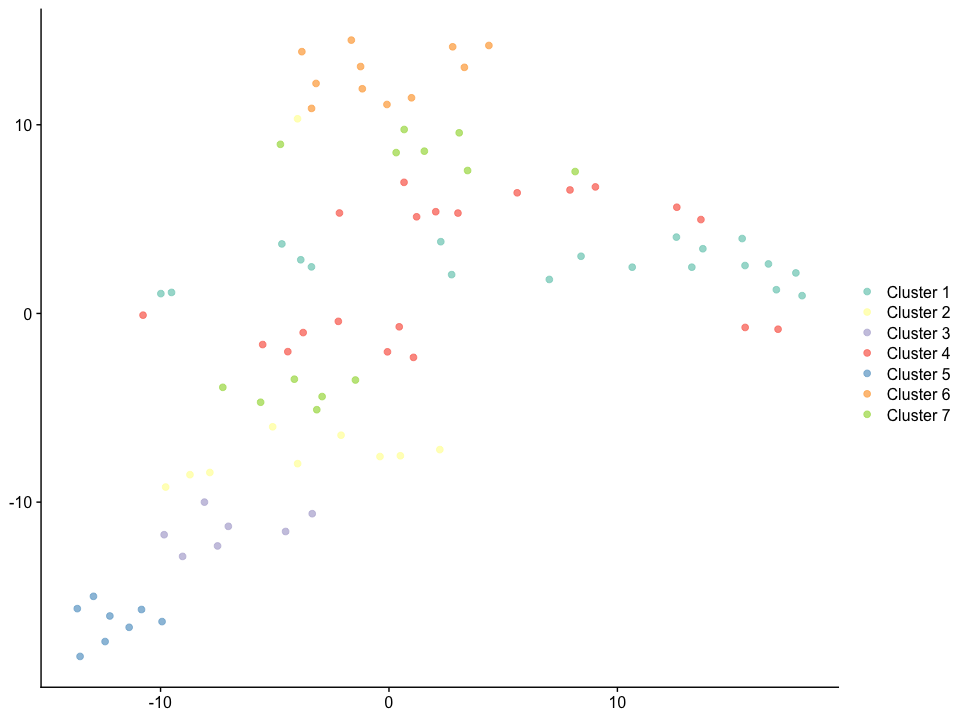<!-- -->

```         
[1] "The total gene number of Cluster 1 is: 19"
[1] "The total gene number of Cluster 2 is: 10"
[1] "The total gene number of Cluster 3 is: 7"
[1] "The total gene number of Cluster 4 is: 20"
[1] "The total gene number of Cluster 5 is: 8"
[1] "The total gene number of Cluster 6 is: 11"
[1] "The total gene number of Cluster 7 is: 13"
```


```r
# setting parameters
dataset = 'LY_15samples_metagenomics'
group = 'Blue_vs_Dark'
SubDataset <- 'Blue_vs_Dark'

var_list <- basic_var(dataset, group, SubDataset)
```

```
## [1] "File ./data/LY_15samples_metagenomics/inputdata/graphdata_Blue_vs_Darklabeled.csv exists."
```

```r
GeneSet_bycluster <- list('Cluster 1', 'Cluster 2', 'Cluster 3', 'Cluster 4', 'Cluster 5', 'Cluster 6', 'Cluster 7')
# GeneSet_byswiss <- list(c('nitrate', 'nitrite'))
# GeneSet_bykegg <- list(c('Phototransduction'))

# Annotation(dataset, group, SubDataset, GeneSet_bykegg,
#            GeneSet_byswiss=0, 
#            GeneSet_bycluster=0)
Annotation(dataset, group, SubDataset, GeneSet_bykegg=0,
           GeneSet_byswiss=0, 
           GeneSet_bycluster)
```

```
## [1] "File ./data/LY_15samples_metagenomics/inputdata/graphdata_Blue_vs_Darklabeled.csv exists."
## [1] "The total gene number of Cluster 1 is: 19"
## [1] "The total gene number of Cluster 2 is: 10"
## [1] "The total gene number of Cluster 3 is: 7"
## [1] "The total gene number of Cluster 4 is: 20"
## [1] "The total gene number of Cluster 5 is: 8"
## [1] "The total gene number of Cluster 6 is: 11"
## [1] "The total gene number of Cluster 7 is: 13"
```

### APP2: Panel enrichment analysis

-   'group_blue.csv' need to be manually created


```r
# rm(list=ls()) 
# --- setting parameters ---
# *dataset
dataset = 'LY_15samples_metagenomics'
group = 'Blue_vs_Dark'
SubDataset <- 'Blue_vs_Dark'
Cluster = 'Cluster 4' # 410 genes

# *set basic data for p-value and other statistic parameters calculations
ref_group <- 'Dark'
group_sample <- 'group_Blue'
group_sample.path <- paste('./data/', dataset, '/inputdata/', group_sample, '.csv', sep = '')
group_sample.data <- read.csv(group_sample.path)
annotation.level <- 'level3_pathway_name'
# === pvalue and statistic analysis ===
rawdata <- obtain_pathdata(dataset, group, SubDataset, 
                            Cluster)
```

```
## [1] "The samples and groups are as follows:"
##  [1] "G3A" "G2A" "R3A" "D2A" "Y1A" "Y2A" "B2A" "R1A" "D3A" "B1A" "Y3A" "B3A"
## [13] "D1A" "G1A" "R2A"
##    Samples  Group
## 1      D2A   Dark
## 2      D3A   Dark
## 3      D1A   Dark
## 4      B2A   Blue
## 5      B1A   Blue
## 6      B3A   Blue
## 7      G3A  Green
## 8      G2A  Green
## 9      G1A  Green
## 10     R3A    Red
## 11     R1A    Red
## 12     R2A    Red
## 13     Y1A Yellow
## 14     Y2A Yellow
## 15     Y3A Yellow
```

```r
# *setting for visualization app
fig.name <- paste('HGP of ', group_sample, sep = '')
  
# --- obtain expression level by pathway ---
library(dplyr)
pathway <- rawdata %>% 
  group_by(level3_pathway_name) %>%
  summarise(Dark1mean = mean(D1A), 
            Dark2mean = mean(D2A),
            Dark3mean = mean(D3A),
            Blue1mean = mean(B1A), 
            Blue2mean = mean(B2A),
            Blue3mean = mean(B3A)) 

# --- obtain p-value ---
df.pathlevel_p <- obtain_pvalue(dataset,ref_group, group_sample.data,  pathway, annotation.level)

# --- obtain other statistic parameters ---
df.pathlevel_p <- ObtainStatistic(pathway, df.pathlevel_p, group_sample.data)

# *set threshod for filtering
p_thre <- 0.275
FC_up <- 1
FC_down <- 1
Expre <- 0

# --- conduct enrichment analysis ---
fig <- enrich(df.pathlevel_p, SubDataset, dataset, Cluster,
                   p_thre, FC_up, FC_down, Expre,
                   group_sample.data)
```

```
## [1] "File ./data/LY_15samples_metagenomics/output_data/R/Blue_vs_Dark_Cluster 4_Enrichment.csv Exist."
```

```r
fig
```

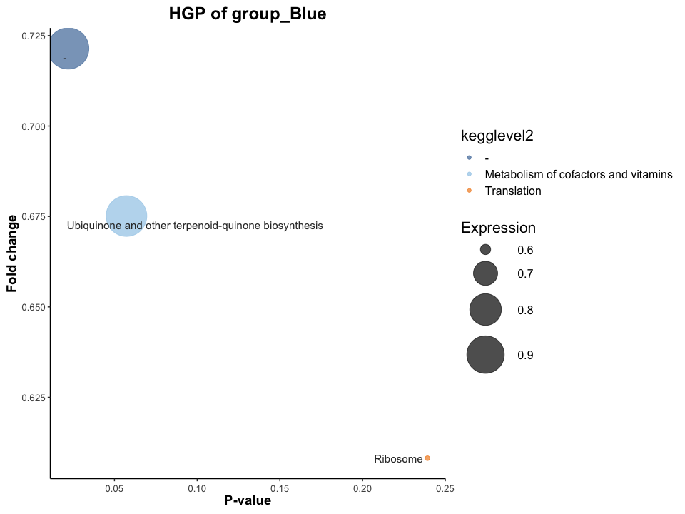<!-- -->

# DEMO4: EES-NHQ

### Graoh learning

dataset_name = 'ZJ_12samplesEES_metagenomics'

group = 'NHQ_vs_Control'

feature shape: (5, 964)

cuda is not available

Threshold: 1

Links number: 12492

Average Links: 12.95850622406639

Adj: (964, 964) Edges: 12492

X: (964, 5)

-   SCI score (Clustering quality) is: 0.5108492

### APP1: 2D-Visualization of gene panels (cluster)


```r
# rm(list=ls()) 
# setting parameters
dataset = 'ZJ_12samplesEES_metagenomics'
group = 'NHQ_vs_Control'
SubDataset <- 'NHQ_vs_Control'

var_list <- basic_var(dataset, group, SubDataset)
```

```
## [1] "File ./data/ZJ_12samplesEES_metagenomics/inputdata/graphdata_NHQ_vs_Controllabeled.csv exists."
```

```r
p <- Clustering(dataset, group, SubDataset)
```

```
## [1] "File ./data/ZJ_12samplesEES_metagenomics/inputdata/graphdata_NHQ_vs_Controllabeled.csv exists."
```

```r
p
```

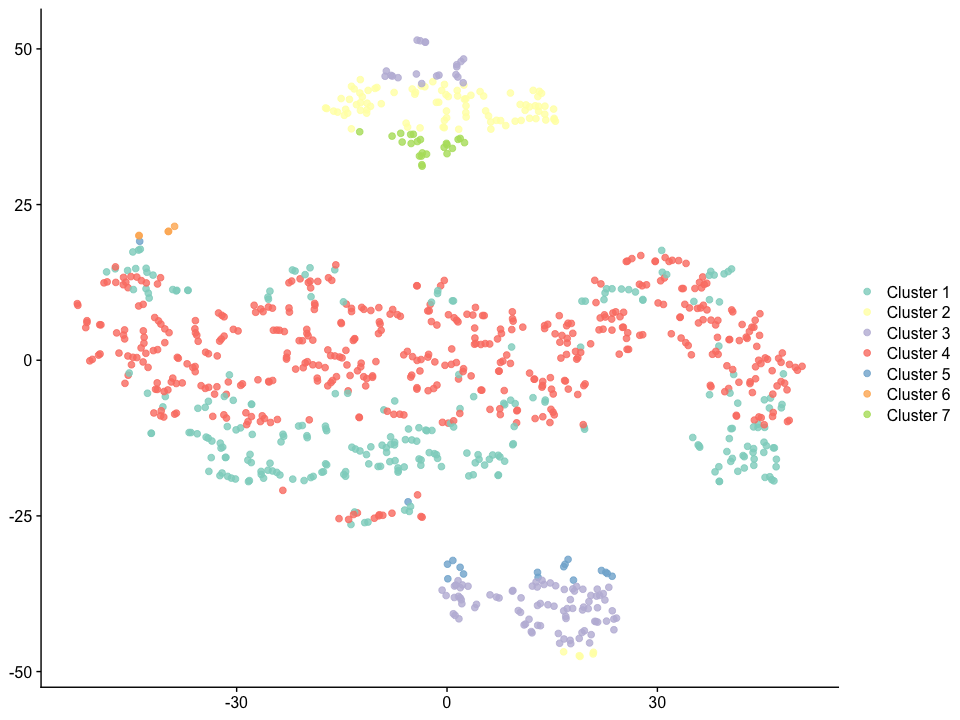<!-- -->

-   Output

    ```         
    [1] "The total gene number of Cluster 1 is: 213"
    [1] "The total gene number of Cluster 2 is: 64"
    [1] "The total gene number of Cluster 3 is: 58"
    [1] "The total gene number of Cluster 4 is: 410"
    [1] "The total gene number of Cluster 5 is: 8"
    [1] "The total gene number of Cluster 6 is: 3"
    [1] "The total gene number of Cluster 7 is: 15"
    ```


```r
# setting parameters
dataset = 'ZJ_12samplesEES_metagenomics'
group = 'NHQ_vs_Control'
SubDataset <- 'NHQ_vs_Control'

var_list <- basic_var(dataset, group, SubDataset)
```

```
## [1] "File ./data/ZJ_12samplesEES_metagenomics/inputdata/graphdata_NHQ_vs_Controllabeled.csv exists."
```

```r
GeneSet_bycluster <- list('Cluster 1', 'Cluster 2', 'Cluster 3', 'Cluster 4', 'Cluster 5', 'Cluster 6', 'Cluster 7')
# GeneSet_byswiss <- list(c('nitrate', 'nitrite'))
# GeneSet_bykegg <- list(c('Phototransduction'))

# Annotation(dataset, group, SubDataset, GeneSet_bykegg,
#            GeneSet_byswiss=0, 
#            GeneSet_bycluster=0)
Annotation(dataset, group, SubDataset, GeneSet_bykegg=0,
           GeneSet_byswiss=0, 
           GeneSet_bycluster)
```

```
## [1] "File ./data/ZJ_12samplesEES_metagenomics/inputdata/graphdata_NHQ_vs_Controllabeled.csv exists."
## [1] "The total gene number of Cluster 1 is: 213"
## [1] "The total gene number of Cluster 2 is: 64"
## [1] "The total gene number of Cluster 3 is: 58"
## [1] "The total gene number of Cluster 4 is: 410"
## [1] "The total gene number of Cluster 5 is: 8"
## [1] "The total gene number of Cluster 6 is: 3"
## [1] "The total gene number of Cluster 7 is: 15"
```

### APP2: Panel enrichment analysis

-   Obtain Pathway

-   group_by, summarise: name need to be set based on the samples' name


```r
# rm(list=ls()) 
# --- setting parameters ---
# *dataset
dataset <- 'ZJ_12samplesEES_metagenomics'
group = 'NHQ_vs_Control'
SubDataset <- 'NHQ_vs_Control'
Cluster = 'Cluster 4' # 410 genes

# *set basic data for p-value and other statistic parameters calculations
ref_group <- 'Control'
group_sample <- 'group_NHQ'
group_sample.path <- paste('./data/', dataset, '/inputdata/', group_sample, '.csv', sep = '')
group_sample.data <- read.csv(group_sample.path)
annotation.level <- 'level3_pathway_name'
# === pvalue and statistic analysis ===
rawdata <- obtain_pathdata(dataset, group, SubDataset, 
                            Cluster)
```

```
## [1] "The samples and groups are as follows:"
##  [1] "z9_1"  "z10_3" "z10_1" "z9_2"  "z11_2" "z11_3" "z10_2" "z11_1" "z1_3" 
## [10] "z9_3"  "z1_1"  "z1_2" 
##    Samples   Group
## 1     z1_3 Control
## 2     z1_1 Control
## 3     z1_2 Control
## 4    z11_2      MV
## 5    z11_3      MV
## 6    z11_1      MV
## 7    z10_3     NHQ
## 8    z10_1     NHQ
## 9    z10_2     NHQ
## 10    z9_1      NR
## 11    z9_2      NR
## 12    z9_3      NR
```

```r
# *setting for visualization app
fig.name <- paste('HGP of ', group_sample, sep = '')
  
# --- obtain expression level by pathway ---
library(dplyr)
pathway <- rawdata %>% 
  group_by(level3_pathway_name) %>%
  summarise(Control1mean = mean(z1_1), 
            Control2mean = mean(z1_2),
            Control3mean = mean(z1_3),
            NHQ1mean = mean(z10_1), 
            NHQ2mean = mean(z10_2),
            NHQ3mean = mean(z10_3)) 

# --- obtain p-value ---
df.pathlevel_p <- obtain_pvalue(dataset,ref_group, group_sample.data,  pathway, annotation.level)

# --- obtain other statistic parameters ---
df.pathlevel_p <- ObtainStatistic(pathway, df.pathlevel_p, group_sample.data)

# *set threshod for filtering
p_thre <- 0.275
FC_up <- 1
FC_down <- 1
Expre <- 1

# --- conduct enrichment analysis ---
fig <- enrich(df.pathlevel_p, SubDataset, dataset, Cluster,
                   p_thre, FC_up, FC_down, Expre,
                   group_sample.data)
```

```
## [1] "File ./data/ZJ_12samplesEES_metagenomics/output_data/R/NHQ_vs_Control_Cluster 4_Enrichment.csv Exist."
```

```r
fig
```

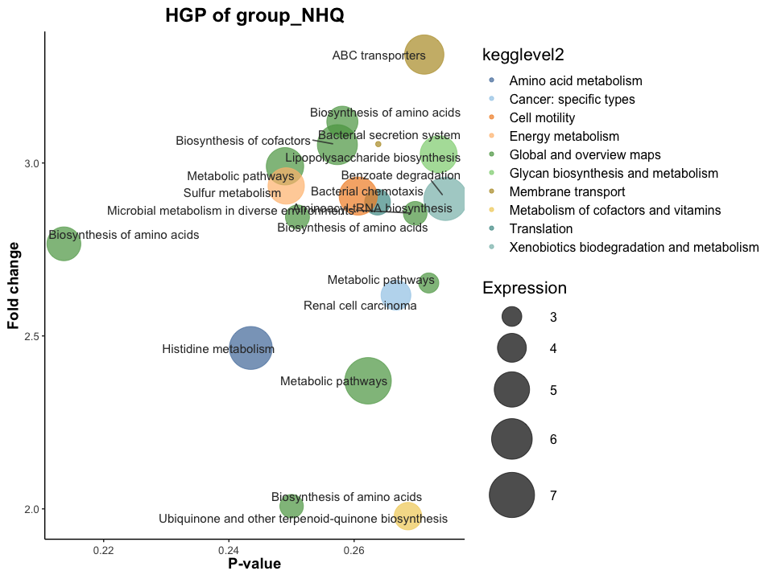<!-- -->
