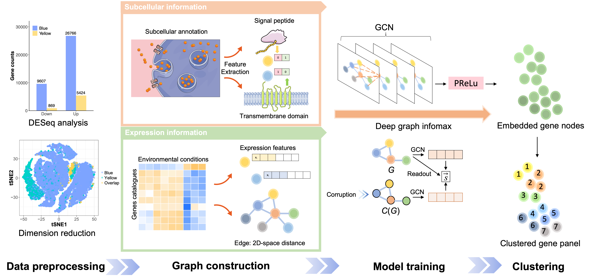

# DGI_CoExp

This is the repository for Research Article: **From mechanism to application: decrypting light-regulated denitrifying microbiome through geometric deep learning**

This repository includes data used for visualization, modeling and statistical analysis. We adopted graph neural networks (GNNs) with Deep Graph Infomax (DGI) algorithm to unsupervised learned the co-expression gene panels, which could be utilized to identify critical pathways and further exploited to construct topological network models. The topological network models reveal the co-expression relationship on the gene level and the identified landmark genes were important bases to develop new microbial regulation strategies.

## 1 Workflow

### 1.1 Wet- and dry-lab water biotechnology development

### 1.2 Workflow of GNN

## 2 Development Environment

- R  4.2.2
- Python 3.8.10
- pytorch 1.11.0
- torch-geometric 2.0.4
- numpy 1.23.0
- pandas 1.4.3
- scanorama 1.7.3
- scikit-learn 1.1.1
- scipy 1.8.1
- matplotlib 3.6.2

## 3 Contact

If you have any questions or feedback, feel free to reach Yang Liao: liaoy21@mails.tsinghua.edu.cn 
