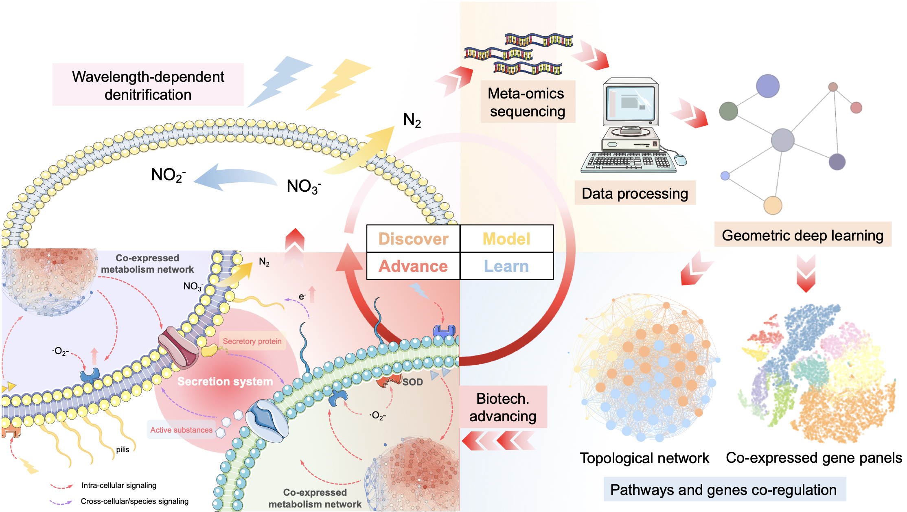

# DMLA
DLMA: Discover-model-learn-advance cycle for unlocking nature as a code base, i.e. encrypting new biological mechanisms and empowering biotechnology development. 



This is the repository for Research Article: **From mechanism to application: decrypting light-regulated denitrifying microbiome through geometric deep learning**

## 1 Requirements

- R  4.2.2
- Python 3.8.10
- pytorch 1.11.0
- torch-geometric 2.0.4
- numpy 1.23.0
- pandas 1.4.3
- scanorama 1.7.3
- scikit-learn 1.1.1
- scipy 1.8.1
- matplotlib 3.6.2

## 2 Utilization 

### 2.1 Dataset preparation


### 2.2 


### 2.3 DEMO


## 3 Citing DMLA

```
@article{liao2023DMLA,
title={From mechanism to application: decrypting light-regulated denitrifying microbiome through geometric deep learning},
author={Yang Liao, Jiyong Bian, Jing Zhao, Ziwei Zhang, Siqi Xu, Yijian Qin, Shiyu Miao, Rui Li, Ruiping Liu*, Meng Zhang, Wenwu Zhu, Huijuan Liu, Jiuhui Qu.},
journal={iMeta},
year={2023},
publisher={Tsinghua University}
}
```

## 4 Contact

If you have any questions or feedback, feel free to reach Yang Liao: liaoy21@mails.tsinghua.edu.cn 
